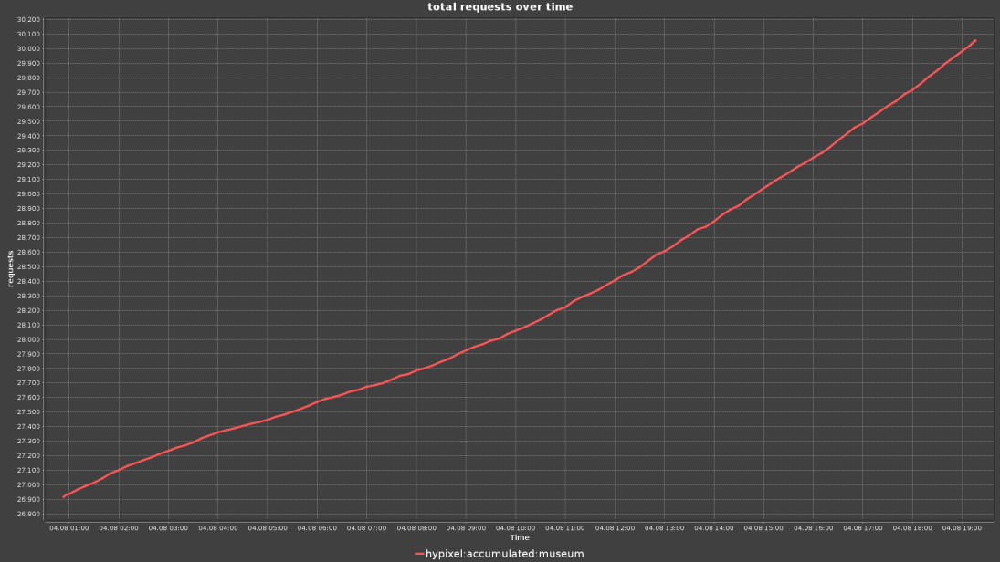
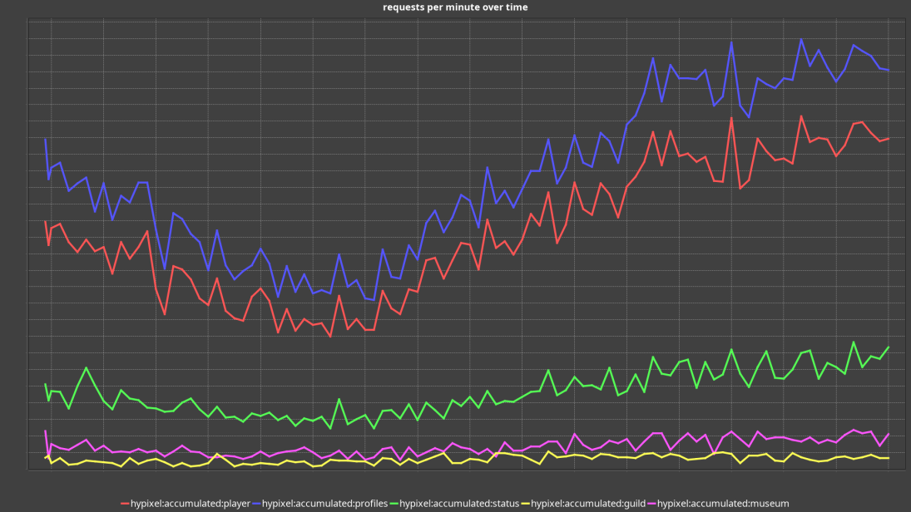

# Ursa minor stats

See [https://github.com/NotEnoughUpdates/ursa-minor/].

Generates nice stat graphs in a discord bot.




## Use via docker: 

```yaml
version: '3'

services:
  stats:
    image: ghcr.io/romangraef/ursa-minor-stat-viewer-stats
    volumes:
      - ./data:/app/data # Use a volume for /app/data so that historical data can persist
    network_mode: host # Use host network if you want to give the container access to host redis. If the redis instance is also part of this docker compose file, this should not be used.
    environment:
      REDIS_PORT: 6379
      REDIS_HOST: 127.0.0.1 # 127.0.0.1 if you use the hosts redis. if you use redis in this docker compose file use that host name instead.
      TOKEN: discord token
```

## Use in discord.


`/metrics delta` displays the delta graph. `/metrics total` displays the total graph. The `key` option can be set to either a comma seperated list of keys you want to graph, or left empty to display all graphs overlayed.
